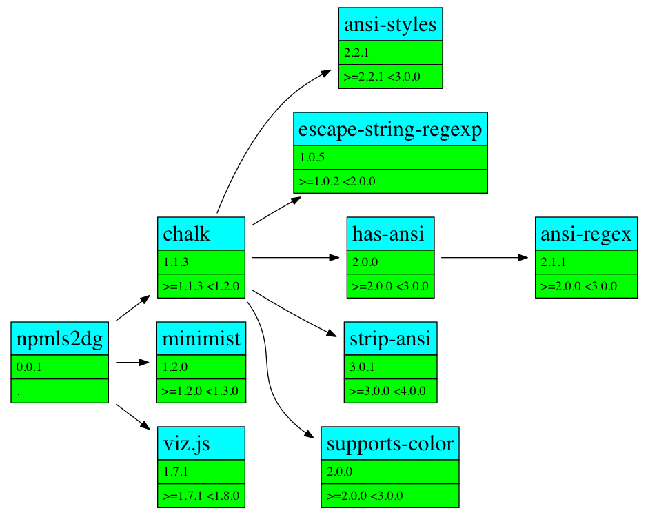

npmls2dg - converts npm ls output to a dependency graph
================================================================================

Generates a dependency graph based on the output of `npm ls --json`.

Drag and drop `.json` files onto the web app here, for live
rendering: https://pmuellr.github.io/npmls2dg

Generates SVG via [viz.js](https://npmjs.org/package/viz.js).

example usage
================================================================================

    npm ls --json --production | ./npmls2dg.js > graph.svg

Generates a `graph.svg` file in the current directory.

To get more help, run:

    npmls2dg -h

install
================================================================================

    npm install -g pmuellr/npmls2dg

reference
================================================================================

* [viz.js](https://npmjs.org/package/viz.js)
* [Graphviz](http://www.graphviz.org/Documentation.php)

license
================================================================================

This package is licensed under the MIT license.  See the
[LICENSE.md](LICENSE.md) file for more information.

contributing
================================================================================

Awesome!  We're happy that you want to contribute.

Please read the [CONTRIBUTING.md](CONTRIBUTING.md) file for more information.
